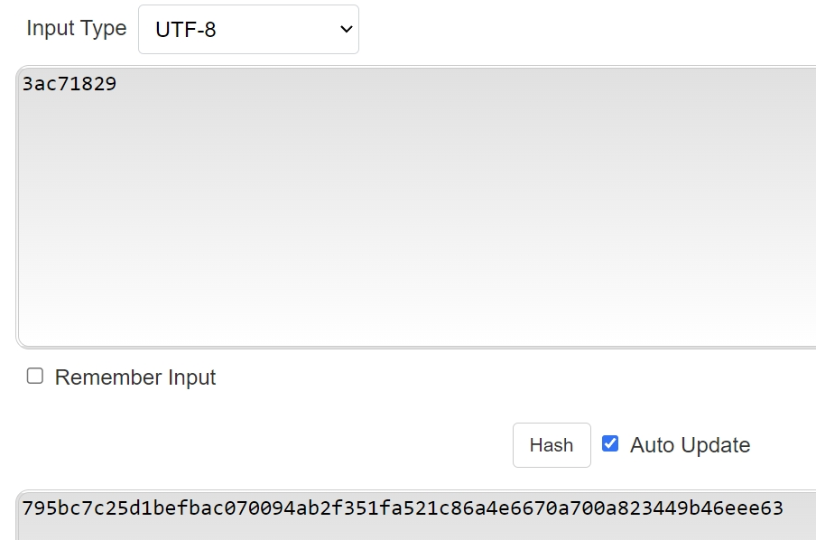
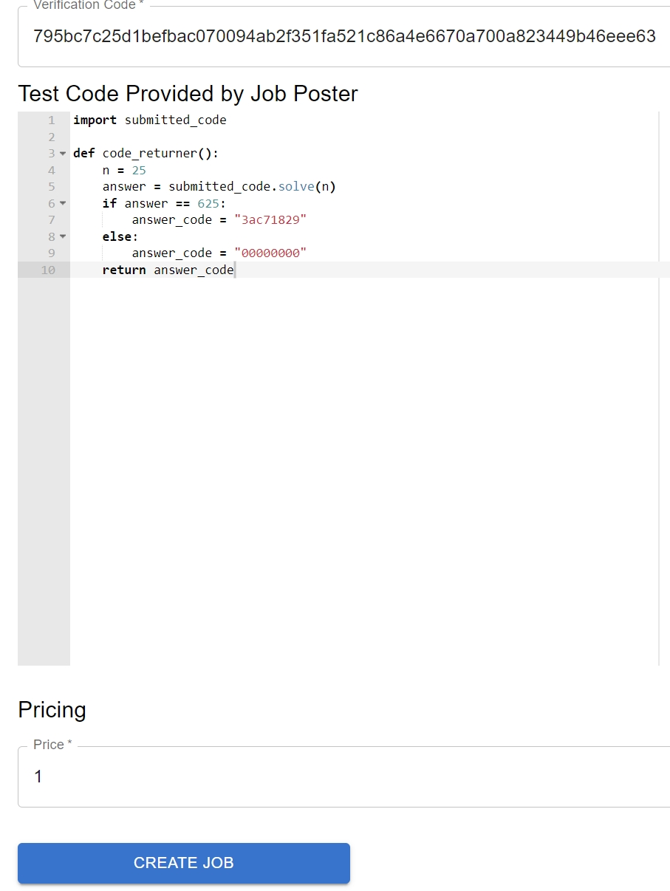

# web3-freelancer
e6998-fa23

clone to your local computer and have docker installed and logged in

for fronend dev, use
```
cd backend
docker build -t backend .
docker compose up
cd ../frontend
npm install
npm start
```
for frontend production, use

```
cd backend
docker build -t backend .
docker compose up
cd ../frontend
docker build -t frontend .
cd ..
docker compose up
```

access the backend at
```
http://localhost:3001
```
access the frontend at (dev)
```
http://localhost:3000
```


auth part: https://github.com/wjh0706/web3-auth

For test part, we have our contract test under main_archive branch.
To test the contract, use 
```
git checkout main_archive
npm install -g truffle
truffle test
```
For backend test, Since we integrated all deployment and auth part, its hard to do it automatically.

Thus, we have set some manual test. Please follow directions for it.
When you successully deploy the app, on the main webpage, you will use test0@email.com to test9@email.com as accounts.

Due to the default settings of ganache, you can use any phrase to unlock the 10 test accounts. But if you signup new accounts, you must suuply the correct phrases.

It will be like this : 
```
Mnemonic:      police loan appear window tackle tennis person secret kidney hurdle object curious
```
The password will something like : 
```
police loan appear window tackle tennis person secret kidney hurdle object curious
```
with no space before first word and after last word, but spaces between words are required.

When creating a post job, you may enter arbitrary strings for project name and project description. 

For verifier's email, it is always 
```
test1@email.com
```
For verification code, use the keccak256 link when you create a job poster.


Copy the test method under ./Testfiles/submitted_code.py with respoect to test number.


Using a different account for job sumbitting. Simply copy the code from ./Testfiles/submitted_code.py with respected to test number.

For verifying, login to test1@email.com. You will see all posted jobs. Those that have been submitted will have verify button avaliable for verifier to click. If the submitted code is correct. The job will be verified.

If the submitted job fails. Clicking the verify button will has no response，but you can see logs on backend terminal about the submission does not meet requirement.

When verifying posted jobs, do not click too many times or it may not response properly. 


Make sure to update the Ethereum node URL, contract JSON file path, and adjust the deployment and interaction process based on your application's requirements. 
Also, consider implementing proper error handling and security measures based on your use case.

To create a complete web application, you'll need additional files such as a backend server to handle the interaction with the Ethereum blockchain, 
a package.json file for managing dependencies.

Run npm install in your terminal to install the required dependencies.

CSS (style.css):
Create a CSS file (e.g., style.css) for styling:

Ensure you replace 'YOUR_CONTRACT_ADDRESS' with the actual address where your Solidity smart contract is deployed. After setting up these files, you can run your Node.js server using npm start and access the application at http://localhost:3000 in your browser. This is a basic example, and you may need to adapt it based on your specific requirements and security considerations.


STEPS : 

Steps :
1. Server deploys the web3 contract. 
2. In an html file, on a single row, server displays the deployed web3 contract's address, a box to accept amount number input, a box to accept job description input, a box to accept job verification code url and a submit button.
3. When the submit button is clicked, the postJob function is called BY THE CLIENT with all the relevant arguments and a verification code that the client only decides.
4. The amount and job description input is sent to the server. The verification code is NOT sent to server (it is needed to ensure secure verification of job).
5. All the contracts for which job is posted, are displayed on a different html file on a different url, which the job solver sees. In this html file, on every row, there is the contract address, a text box to take solution file url (text field), and a submit button.
6. When the job solver clicks submit, the submitWork contract function is called by the JOB SOLVER CLIENT ONLY.
7. The server receives the solution url input from job solver. 
8. Third party will run the python functions, to get code, and call verifyWork.
8. The server then calls the verifyWork function with verificationCode.
9. On seeing the contract state change to Verified, the job poster client calls the paymentReleaser function.
10. Third party releases the solution to the jobPoster on Web2.

Note : All the addresses we'll be using are the default web3.eth.addresses addresses.

What the server needs to do :

1. Server deploys the web3 contract, with the address of the 3rd party verifier. 
2. Show all the deployed empty contracts (without the jobs) on an html page. 
3. Show the appropriate pages to both job poster and potential solvers.
4. Checks both the submitted python files, runs the verification script, and calls the Contract function Verify with the verification code. (This will automatically update the contract state).
5. Server needs to keep scanning the contract instances to see if any contract turns to state paid. 
6. On detecting this, the server needs to send the submitted python file to the job poster. This can just be a link which the job poster html page now has.

Addresses are public, with username and password.

What will the clients do?

1. Make all the web3 calls from the jobposter and jobsolver privately.
2. Ensure that some things like the verification code do not go to server.

Next meet : Nov 25th.
Try to finish all these tasks by : 30th Nov.
