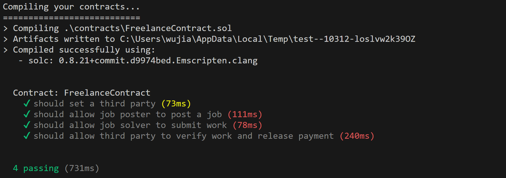

# Web3-Freelancer E6998-004 fa23
Jianghao Wu

Jiming Yu

Akshay Iyer

## Proposal

### Introduction

We aim to use the power of web3 to bring together freelancers and employers like never before. Welcome to our platform freelancer, that enables quick, easy freelancing for software jobs, without wasting any time with meetings and delays from either side.

### Pain points

Current freelancing has a few problems.

It is heavily based on individual employer-freelancer matching which is often time consuming and effortful. This removes the possibility of getting a freelancer to do small, quick projects.

Freelancers also often do not get compensated because of employers defaulting on payments once the work is done.

One other big disadvantage of the web2 freelancing model is that if freelancers cause delays, then the employer has no option but to wait.

### Why web3?

Web3 enables anonymous job completion. We can leverage this by allowing automatic matching and job submission with no employer-freelancer interaction. Freelancers don’t need to commit to employers and don’t face a risk of their rating decreasing if they are unable to complete a job.

Payments on web3 are not centrally controlled, which makes it impossible for any third party to take commission on freelancing payments. Transactions are direct between employers and freelancers.

Security concerns are mitigated, making it impossible for third parties to manipulate submissions or verify false submissions.

### Our Solution

The biggest change we make is, we do not connect freelancers and employers. Jobs are completed on a purely FCFS basis. The employer and freelancer deal with the smart contract individually and independently.

We accept a job description, payment amount, python testing code, and a verification code (that is not communicated to the server) from the job poster.

The job solver only submits a python file in the specific format. (Pre-decided function names and file names).

On running the employer code with the freelancer’s code, a verification code is generated only if the relevant testcases pass successfully. The third party generates a verification code from the submission python files and sends it to our smart contract.

The job is verified only if this verification code matches the verification code entered by the employer (which the third party does not know).

The first freelancer to satisfy all the testcases successfully gets the money automatically, and the job is marked as complete.

Why can this not be done in web2?

Payment automation is more difficult and not as secure as web2.

More importantly, in web2 the verification code has to be communicated with the third party for them to verify the job. The third party can act maliciously.

Thus, anonymous and competitive job solving is made easier by web3.

### Demo Video (recorded on Demo Day)

Here is our video link! : https://youtu.be/czj5lmWKfog 

## Deploy

clone to your local computer and have docker installed and logged in

run the following command to build the images of the backend and the frontend
```
cd backend
docker build -t backend .
cd ../frontend
docker build -t frontend .
cd ..
```
Make sure you are at the root of the project, run
```
docker compose up
```

access the backend at port 3001
```
http://localhost:3001
```
access the frontend at port 80
```
http://localhost
```

## Test the contract

For test part, we have our contract test under test_sol folder.
To test the contract, use 
```
cd test_sol
npm install -g truffle
truffle test
```

All the tests pass!



## Test the backend

For backend test, Since we integrated all deployment and auth part, its hard to do it automatically.

Thus, we have set some manual test. Please follow directions for it.
When you successully deploy the app, on the main webpage, you will use test0@email.com to test9@email.com as accounts.

Due to the default settings of ganache, you can use any phrase to unlock the 10 test accounts. But if you signup new accounts, you must suuply the correct phrases.

It will be like this : 
```
Mnemonic:      police loan appear window tackle tennis person secret kidney hurdle object curious
```
The password will something like : 
```
police loan appear window tackle tennis person secret kidney hurdle object curious
```
with no space before first word and after last word, but spaces between words are required.

When creating a post job, you may enter arbitrary strings for project name and project description. 

For verifier's email, it is always 
```
test1@email.com
```
For verification code, use the keccak256 link when you create a job poster.


Copy the test method under ./Testfiles/submitted_code.py with respoect to test number.


Using a different account for job sumbitting. Simply copy the code from ./Testfiles/submitted_code.py with respected to test number.

For verifying, login to test1@email.com. You will see all posted jobs. Those that have been submitted will have verify button avaliable for verifier to click. If the submitted code is correct. The job will be verified.

If the submitted job fails. Clicking the verify button will has no response，but you can see logs on backend terminal about the submission does not meet requirement.

When verifying posted jobs, do not click too many times or it may not response properly. 

### Testing Video
#### Successful Case 1
https://youtu.be/oHUPxAJPNAY
#### Successful Case 2
https://youtu.be/QQ8wgH8obVo
#### Failed Case
https://youtu.be/_42JgzL_cqk
#### Test for authentication
https://youtu.be/5SMI_JvHaVA

## Security
### How does our smart contract work?

We have a smart contract with 3 parties, jobPoster, jobSolver and thirdParty(Verifier). 
The third party is set automatically by our website, routed to a third party address employee who is available to verify the job.
We implement contract states - Created, jobPoster, jobSubmitted, Verified and PaymentDone, in order to not let anyone access the contract at the wrong time.

The way we verify the job is as follows:
1. Job poster creates their test cases such that it returns a verification string. The job posters code will import submitted functions from the jobSolver's code. 
   This code will return the correct verification string only if all the testcases pass. 
2. Job poster submits their testing code, and verification string hash (not raw verification string) to us while posting a job.
3. This submitted job description is now visible to everyone publicly.
3. Job Solver creates their test cases with functions according to the predefined requirement by the job poster. 
4. Job Solver submits their code to the platform.
5. Third party uses both these submitted codes and obtains a verification string which may be right or wrong. Our platform will automatically run these submitted files and hash the result, and make a call to the smart contract.
6. The smart contract will check if the submitted hashes of verification strings match, and only then will send the payment. If verification string does not match, the contract state is reverted back to as if no submission was made from jobSolver.
   The contract is free to be solved by someone else if they get a wrong submission, and is valid until someone submits valid code and the payment is done.
7. Only if the payment is done and the job is successfully completed, our platform shares the correct submitted code for the task with the jobPoster.

### Addressed security concerns
1. We now ensure the job poster never shares their verification string with us.
2. The contract state never stores the verification string now.
3. All the authentications and pymants are done on the blockchain.
4. Sensitive info such as the 12-word seed phrase, verification code is never saved in the database.

We also implemented some security measure to ensure the web2 part is also safe. For example, we require the user to be logged in to post jobs, submit jobs at the backend. 

### Key Developments since Demo day

#### We have made our platform much more secure.

Since Prof. Junfeng rightly mentioned, all the contract states and details can be freely accessed online.
It does not make sense to add the verification code string in the contract.
Also, another key problem was that the job poster needs to enter their verification string on our website. Even though this string never entered our database,
this requires an assumption that our platform won't act maliciously.
Thus now, we are asking the user, and linking them to a website to get a keccak256 hash of their verification string, and we accept the hash in our browser.
During job verification, we obtain the verification string by running the submitted files, and send it's hash to the contract too to verify equality.
Thus - 
1. The verification code is never seen in the contract state.
2. The user doesn't need to trust the website.
3. UI updated.


#### We have added code for testing our website. 
We have included automated tests to test our smart contract using truffle.
We also have manual tests to test our backend and server.

## Deployment of the contract
https://sepolia.etherscan.io/address/0xb6DfF9A53EaC474cdE3ABa2936848A7A84f91f5C
